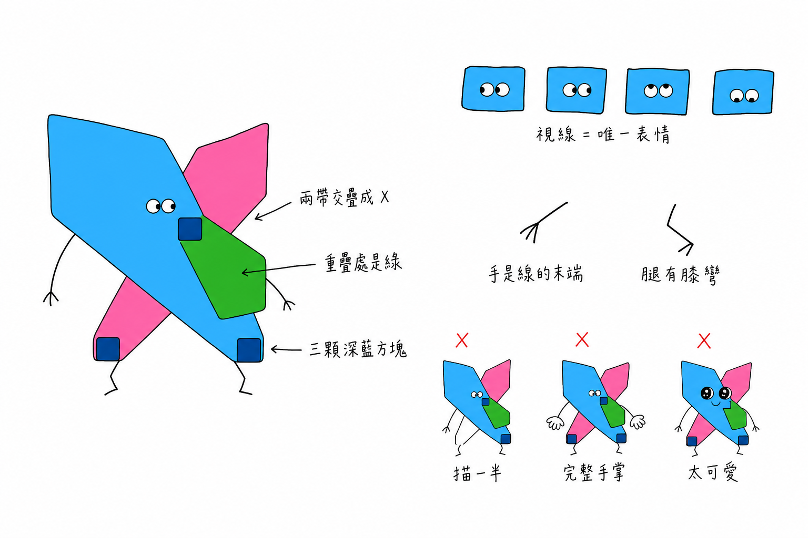
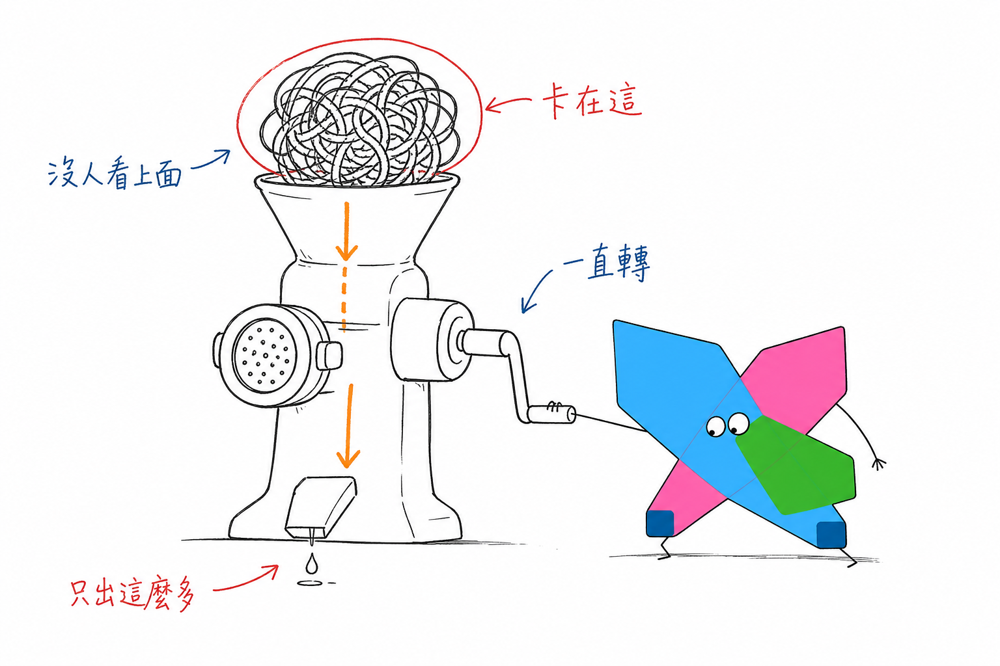
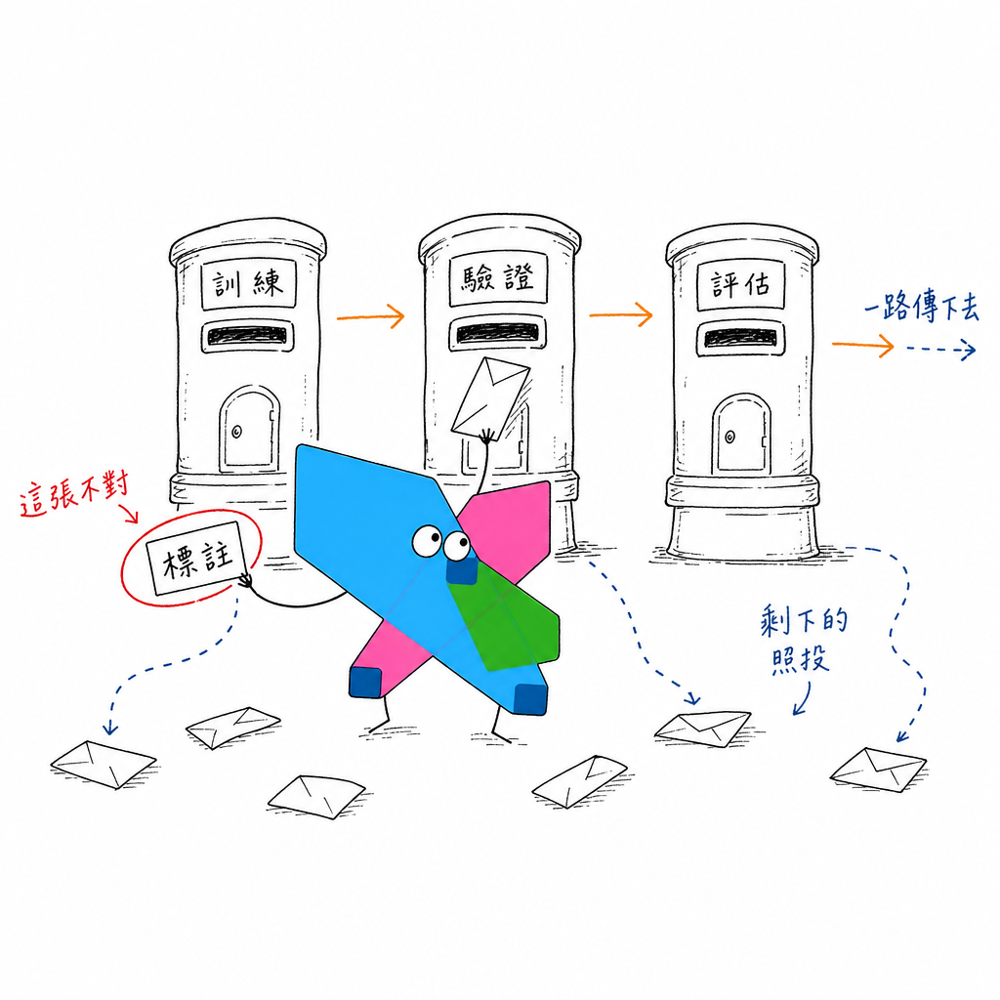
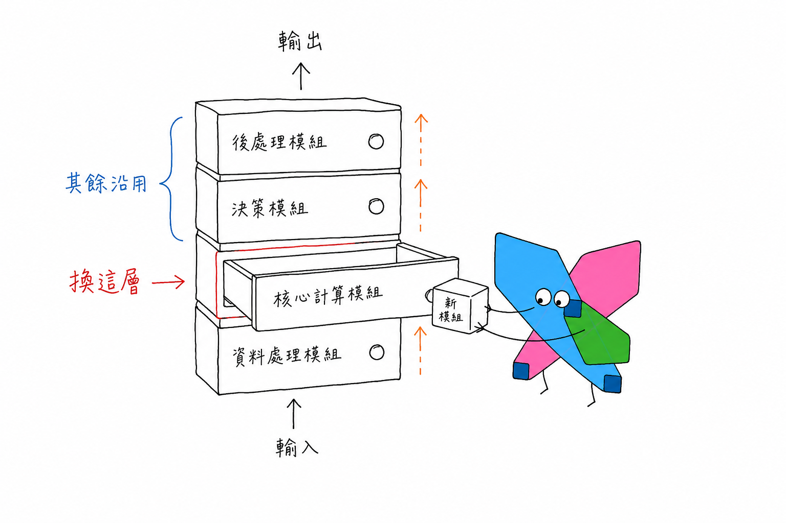
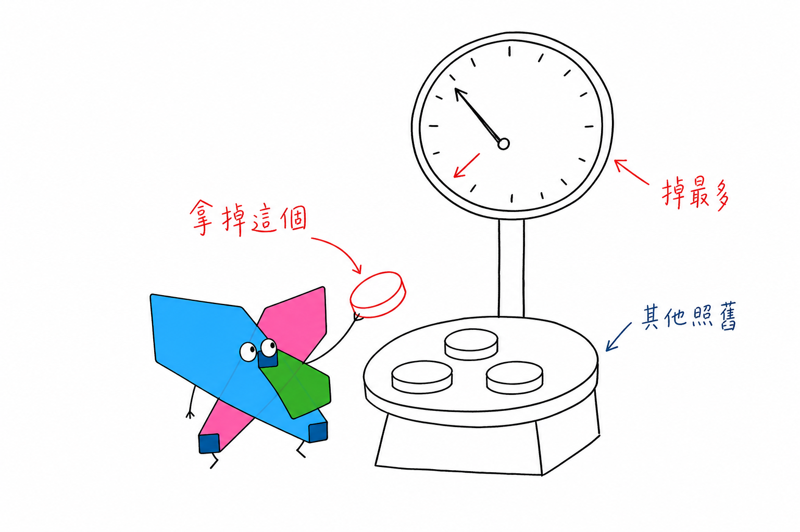
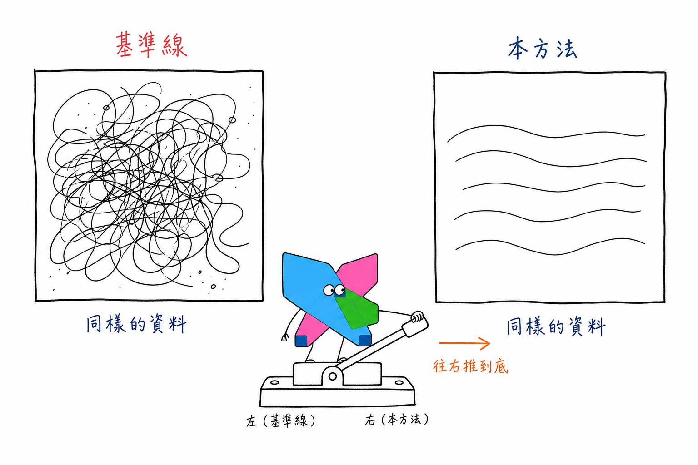

# CIHCI Illustrations

> CIHCI Illustrations 是用來為 CIHCI Lab 的文章、貼文、論文、計畫書與簡報生成配圖的 agent skill。

> 把內容裡的判斷、流程、狀態和隱喻，變成一張張白底、手繪但清爽的配圖。

## CIHCI 醬
- 身體是實驗室 logo 的幾何形，其餘擬人特徵沿用手繪小怪物的作法：
    - 一圈完整的黑色手繪輪廓
    - 兩顆緊鄰的眼睛落在身體中央
    - 細腿、細手臂，黑色細線，手腳末端都是極簡的線
    - 瞳孔方向是牠唯一的表情



> 完整描述見 [`references/cihci-ip.md`](references/cihci-ip.md)

## 視覺風格

- 純白背景，不要紙紋、米色、陰影、漸層
- 黑色手繪線稿，細線，輕微抖動
- 大量留白，少量紅色、橙色、深藍色正體中文手寫批註
- 一張圖只表達一個核心動作、結構、狀態或隱喻
- CIHCI 醬必須參與核心動作，不能只是裝飾
- 有創意、清爽，但不幼稚、不賣萌

> 批註的藍必須是深藍 `#015DA0`，不要用亮青藍，亮青藍是 CIHCI 醬身體的顏色，撞色會讓人分不清哪個是角色、哪個是註解。

## 模式

> 預設是正文模式，只有明說要做論文圖、方法架構、實驗設計或投影片圖解時，才切到學術圖解模式。

| | 正文模式（預設） | 學術圖解模式 |
| :--- | :--- | :--- |
| 適用 | 文章正文配圖、部落格、社群貼文、實驗室對外宣傳 | 論文插圖、計畫書圖解、簡報投影片、Lab meeting |
| 禁流程圖／架構圖 | 是 | 否，允許方法架構、實驗設計、資料流 |
| 節點上限 | 不畫節點圖 | 5–7 個 |
| 畫面比例 | 16:9 | 1:1、3:2、4:3 |

## 它會產出什麼
預設輸出：
- 指定比例的手繪配圖
- 一份內容的 4–8 張 shot list
- 每張圖的主題、核心意思、模式、結構型、比例、CIHCI 醬動作和正體中文批註建議
- 最終 PNG，存到 `assets/<主題-slug>-illustrations/`

But not：
- PPTX / PDF / Keynote
- SVG / HTML / Canvas 可編輯圖
- 商業海報或封面主視覺
- 大段文字型資訊圖
- 長條圖、折線圖等統計圖表

## Example
> 五張涵蓋四種比例與兩種模式，內容彼此不重複。

* ### 卡住的不是方法，是資料
    > 正文模式 · 16:9 · 概念隱喻
    
    

* ### 標註品質決定天花板
    > 正文模式 · 1:1 · 角色狀態

    

* ### 方法架構：只有一層真的動過
    > 學術圖解模式 · 3:2 · 方法架構

    

* ### 消融實驗：拿掉哪一項，掉最多
    > 學術圖解模式 · 4:3 · 實驗設計

    

* ### 本方法與基準線的差別只在一個開關
    > 學術圖解模式 · 3:2 · 結果對照

    

### 這幾張怎麼生的
> 技能本身把生圖交給代理內建的 `image_gen`。上面這五張是用倉庫裡的 `tools/generate_examples.py` 生的——那支腳本是給「手邊沒有內建生圖工具、但有 OpenAI 金鑰」的情況用的離線補救：
```bash
export OPENAI_API_KEY=...
python tools/generate_examples.py            # 全部五張
python tools/generate_examples.py --only 03  # 只重跑一張
python tools/generate_examples.py --list     # 只看 shot list，不呼叫 API

python tools/generate_model_sheet.py         # 角色設定圖
```

## 安裝

克隆倉庫：

```bash
git clone https://github.com/Jung217/cihci-illustrations.git
cd cihci-illustrations
```
> 倉庫根目錄本身就是技能——`SKILL.md`、`references/`、`assets/` 都在根層，整個複製過去即可。README、LICENSE、NOTICE、`tools/`、`PROMPTS.md` 會一起被複製，但技能只讀 `SKILL.md` 和它引用的檔案，不影響運作。

### Claude Code
```bash
mkdir -p ~/.claude/skills
cp -R . ~/.claude/skills/cihci-illustrations
```
> 安裝後直接描述任務即可觸發，或用 `/cihci-illustrations`。

### Codex
```bash
mkdir -p "${CODEX_HOME:-$HOME/.codex}/skills"
cp -R . "${CODEX_HOME:-$HOME/.codex}/skills/cihci-illustrations"
```

安裝後：
```text
Use $cihci-illustrations 為這篇文章設計並生成 5 張 CIHCI 醬荒誕配圖。
```
> 目標資料夾名稱必須是 `cihci-illustrations`，要跟 `SKILL.md` 裡的 `name:` 一致。

### 其他 agents
> Skill 本體是純 Markdown，沒有相依套件。把整個倉庫放進該 agent 的 skills，或直接把 `SKILL.md` 與 `references/` 餵給它即可。

## 怎麼用
> 範例圖只是構圖範本，使用時應該從當前內容重新定義隱喻，不要照抄。
### 只做配圖規劃

```text
先不要生圖。
請分析下面這篇文章哪裡值得配圖，輸出 5 張左右的 shot list。
每張圖寫清楚：放在哪段後、主題、核心意思、模式、結構型、比例、CIHCI 醬在做什麼、建議正體中文批註詞。

<貼上文章>
```

### 直接生成正文配圖

```text
把下面這篇文章生成 4 張 CIHCI 醬荒誕正文配圖。
要求：16:9 橫版、純白背景、黑色手繪線稿、少量紅橙深藍正體中文手寫批註。

<貼上文章>
```

### 論文方法架構圖

```text
切到學術圖解模式，為下面這段 method 生成一張論文插圖。
比例 3:2。模組不超過 5 個，全部手繪抖動，留白至少 35%。
CIHCI 醬要站在其中一個模組裡動手調整。

<貼上 method 段落>
```
> 更多範例見 [PROMPTS.md](PROMPTS.md)。

## 工作流程
1. 讀取文章、Markdown、論文草稿、擷圖或使用者給的主題
2. 判斷用正文模式還是學術圖解模式，決定比例
3. 提煉核心觀點、認知轉折、方法結構和適合視覺化的段落
4. 先輸出 shot list：每張圖只選一個認知錨點
5. 為每張圖選結構型
6. 重新發明一個低科技、荒誕但成立的物理隱喻，並確認沒跟這批其他圖撞
7. 讓 CIHCI 醬承擔核心動作
8. 每張圖單獨呼叫圖像模型生成
9. 照 QA 檢查表檢查：白底、留白、CIHCI 醬三要件、只有 IP 是彩色、正體中文、非 PPT 感
10. 存最終 PNG，並回報用途和路徑

## 目錄結構

```text
.
├── SKILL.md                # 技能入口
├── package.json
├── agents/
│   └── openai.yaml         # Codex 介面設定
├── references/             # 技能依需要讀取
│   ├── style-dna.md
│   ├── cihci-ip.md
│   ├── composition-patterns.md
│   ├── prompt-template.md
│   └── qa-checklist.md
├── assets/
│   ├── ip/
│   │   ├── cihci.png                   # 無字版，畫角色與餵參考圖用這張
│   │   ├── cihcilab.png                # 含字版，只用於品牌標示
│   │   └── cihci-chan-model-sheet.png  # 角色設定圖
│   └── examples/           # 產出的配圖，兼作風格校準樣本
├── tools/                  # 離線生圖腳本，非技能的一部分
│   ├── image_api.py        # 兩支腳本共用的 OpenAI 影像 API
│   ├── generate_examples.py
│   └── generate_model_sheet.py
├── PROMPTS.md              # 提示詞範例
├── README.md
├── LICENSE
└── NOTICE.md
```

## 生成時的 TMI
### 寫提示詞的時候
- 照 references/prompt-template.md 組提示詞，並把 assets/ip/cihci.png 當參考圖一起送出。實測純文字描述撐不住 CIHCI 醬的外形，會在「明確交叉的 X」和「寬扁緞帶比例」之間來回走鐘，加參考圖才穩得住。
- 不要餵含字版 cihcilab.png，否則圖裡會冒出「CIHCI LAB」字樣。
- 明講色塊是 solid（平塗、邊到邊同色、無紋理無深淺）。不強調的話模型會自己加筆觸或漸層，違反 style-dna.md。
- 圖裡的中文字越短越穩定；一張圖只講一個核心結構，不要把內容做成說明書。
- CIHCI 醬必須承擔核心動作。如果拿掉它畫面仍然完全成立，代表它太裝飾了。
- 描述 CIHCI 醬的手腳時字要少。寫得越細，模型就把牠畫得越大、擠掉場景——手指、肘關節、腳掌這些細節根本畫不進一個小角色裡。
- 不要規定角色占畫面的百分比。實測寫「20–25%」得到 16.6%、寫「主物件的四成」得到 13.5%、完全不寫反而落在 24%。提了就縮，不提最準。

### 選模型與跑腳本
- 兩支腳本都預設 gpt-image-2，可以用 --model 換掉，但建議別換。實測 gpt-image-1.5 會把色塊畫成蠟筆質感，而且同一張圖就寫錯三個中文字；gpt-image-2
連跑七版一個錯字都沒有。這套配圖每張都要寫中文批註，中文手寫的準確度是選模型的第一順位。
- 腳本沒有自動重生：它只保證單張 API 失敗不中斷整批。品質要照 references/qa-checklist.md 人工看過，不合格再 --only 重跑該張。

### 生成後一定要看
- CIHCI 醬容易走鐘，尤其是綠色重疊區和三個深藍方塊常常掉，每張都要檢查三要件。
- AI 圖像模型可能寫出簡體字。錯字嚴重時優先減少批註數量再重生成。
- 視線能不能離開瞳孔中心是穩的，指向哪個方向不受控。笑點靠視線的圖要生完檢查，不要靠加字硬凹。
- 一批圖之間容易撞隱喻，生第二張以前先回頭看前面用過什麼物件和動作。

## Reference
> 本專案改編自 [Ian Xiaohei Illustrations](https://github.com/helloianneo/ian-xiaohei-illustrations)，改動內容與 IP 歸屬見 [NOTICE.md](NOTICE.md)。
